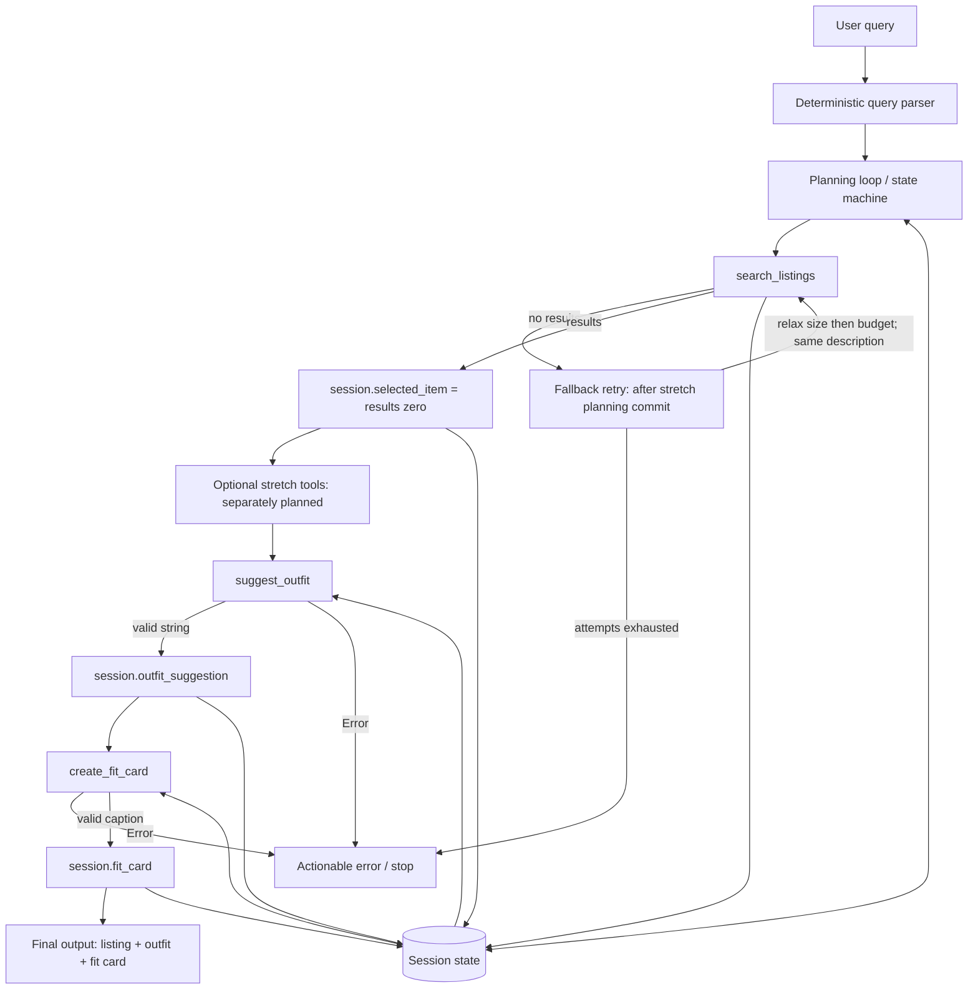
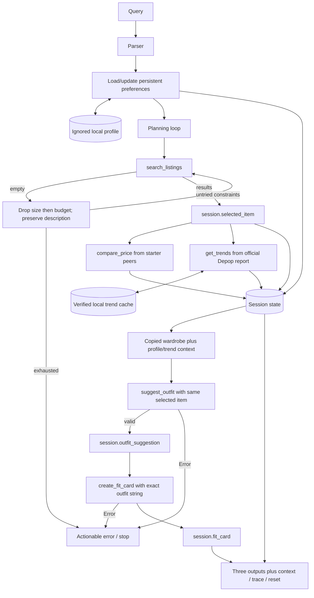

# FitFindr implementation plan

## Scope and sequence

Use the official CodePath starter, its unchanged data loader, 40 mock listings, and example/empty wardrobe helpers. Listings are classroom data, not live inventory. Commit this required-feature plan before editing tools.py, agent.py, or app.py. Implement and pass isolated required-tool tests before wiring the agent. Commit required implementation/tests, then expand and commit this plan before implementing any stretch feature. The retry branch below specifies the intended final design; the required-only checkpoint stops on zero results until the separately planned retry implementation lands.

## Required tool inventory

### Tool 1: search_listings

```python
search_listings(description: str, size: str | None = None, max_price: float | None = None) -> list[dict]
```

`description` contains item/style keywords; normalize case and whitespace and discard conversational stop words. Use meaningful token/phrase overlap in title, description, category, style_tags, colors, and brand; emphasize title/tags and sort descending by relevance, then price/id for deterministic ties. Recognized garment nouns must match the garment family (a tee query must not select a hoodie merely because both are vintage).

`size` is an optional labeled size; None skips size filtering. Support small/medium/large aliases, slash alternatives such as S/M, numeric US shoe sizes, and waist/length labels. Match complete size tokens, never substrings (S must not match XS, 8 must not match 8.5, M must not match the word medium in an item description). Ignore parenthetical fit notes. One Size matches only a One Size request; do not assume it fits everybody. Blank size means absent. Malformed explicit sizes raise ValueError, allowing the agent to explain how to correct them.

`max_price` is an optional finite, nonnegative inclusive USD ceiling; None skips budget filtering. Invalid values raise ValueError. Use load_listings(), return [] for ordinary no-match/blank-description searches. Dataset read/JSON failures propagate to the agent as a controlled data-load error.

Return the original matching listing dictionaries, without added score fields: `id: str`, `title: str`, `description: str`, `category: str`, `style_tags: list[str]`, `size: str`, `condition: str`, `price: float`, `colors: list[str]`, `brand: str | None`, `platform: str`. Every result retains all 11 fields from data/listings.json.

### Tool 2: suggest_outfit

```python
suggest_outfit(new_item: dict, wardrobe: dict) -> str
```

`new_item` is the selected listing, used verbatim from search results. `wardrobe` contains an items list of named wardrobe dictionaries, usually from get_example_wardrobe() or get_empty_wardrobe(). Return a non-empty string describing 1–2 realistic outfits; use only specific named pieces in a populated wardrobe. Preserve actual item details. A minimal wardrobe may be incomplete: say which category would be useful as an optional purchase rather than pretending it is owned. An empty/missing items list requests general styling advice, clearly labeled as suggestions rather than owned items.

Call Groq model `meta-llama/llama-4-scout-17b-16e-instruct` at temperature 0.5. Initialize lazily using GROQ_API_KEY from the repository .env/environment, with a finite timeout and bounded retries. Use structured JSON output with wardrobe IDs so membership can be validated before rendering names; narrative must not invent owned pieces. Missing item, missing key, real API exceptions, empty/malformed model content return non-empty strings beginning `Error:` with an actionable next step. Never include exception bodies, credentials, or stack traces. An Error string is not a valid outfit and must never be sent to the caption tool.

### Tool 3: create_fit_card

```python
create_fit_card(outfit: str, new_item: dict) -> str
```

`outfit` is the exact successful suggestion string; `new_item` is the same selected listing. Return a casual, authentic 2–4 sentence OOTD caption mentioning the exact title, price and platform once, plus the outfit vibe. Use the same required Groq model at temperature 0.85. Generate structured sentence content and validate length/content before rendering. None, empty, whitespace-only or Error-prefixed outfit returns `Error: A valid outfit suggestion is required before creating a fit card.` Invalid item, missing credentials, API failures, or invalid generated content return a recognizable `Error:` string suggesting correction or retry. Do not throw for ordinary invalid inputs or leak API exception detail.

## Planning loop

Deterministic parsing avoids a network call for obvious fields. Extract `size M`, `in medium`, `size US 8`, `under $30`, `under 30 dollars`, `$30 max`, `up to $30`, or `budget $30`. Absent size/price becomes None; invalid explicit size or negative budget produces an actionable error, not silent filter removal. Strip the constraint spans and conversational preamble from the shopping description; keep preference clauses separately so 'I mostly wear baggy jeans' cannot make a tee search select jeans.

```text
START -> new session -> validate nonblank query -> parse
PARSE error -> actionable constraint error -> STOP
SEARCH -> search_listings(**parsed) -> store search_results
IF no results:
    required-only checkpoint: error with broadening instructions -> STOP
    final stretch behavior (implemented only after second planning commit):
        retry same description with size=None, same ceiling (if size was set)
        then same description with size=None, max_price=None (if price was set)
        record original/changed constraints, reason and count for every attempt
        IF still no results: actionable error -> STOP
IF results:
    selected_item = search_results[0]
    optional stretch context tools (planned separately) -> enrich wardrobe context
    suggest_outfit(selected_item, wardrobe) -> inspect return
    IF Error/empty: identify outfit failure -> STOP
    ELSE outfit_suggestion = exact returned string
    create_fit_card(outfit_suggestion, selected_item) -> inspect return
    IF Error/empty: retain successful earlier state, identify caption failure -> STOP
    ELSE fit_card = returned string -> DONE
```

Empty wardrobe is not terminal: generate general advice. Optional-tool failures must never bypass required success gates. Neither downstream required tool runs after terminal search failure. On caption failure preserve the valid outfit in the session; UI shows the actionable error with later panels blank to avoid presenting an incomplete run as success.

## State management

| Field | Written when | Consumer |
|---|---|---|
| query | session creation | parser |
| parsed | parse succeeds: description, size, max_price | search; retries copy rather than overwrite original |
| search_results | each completed search | selection |
| selected_item | results nonempty; direct reference to results[0] | outfit and caption tools |
| wardrobe | session creation, deep copy of helper data | outfit; later controlled metadata enrichment |
| outfit_suggestion | successful outfit result | caption tool, exact string |
| fit_card | successful caption result | UI/CLI |
| error | validation/tool terminal failure; initially None | UI/CLI; stops state machine |
| tool_trace | each call/result/transition | read-only demonstration, no secrets |
| stage | parse/search/outfit/card/done/error | planning loop |
| retry_history | final retry implementation only | UI explanation |
| price_assessment | planned stretch comparison after selection | UI |
| trend_info | planned stretch retrieval after selection | wardrobe metadata -> outfit |
| style_profile_used | planned memory load/update | wardrobe metadata -> outfit |

Identity tests will assert `session['selected_item'] is session['search_results'][0]`, identical item references reaching both tools, and exact outfit string passing into create_fit_card. No intermediate user re-entry. Trace records sanitized public listing IDs, parsed constraints, counts, and transitions; never logs the environment or raw API errors.

## Error handling

| Tool/step | Specific failure | Controlled response and next action |
|---|---|---|
| search_listings | No matching item | [] at tool; agent retries only allowed constraints after stretch, then says broaden description, remove size, or increase budget; no outfit call |
| search_listings | Malformed size or negative/nonfinite ceiling | ValueError; agent asks for size M/US 8/W30 or a nonnegative USD budget |
| search_listings | Missing/unreadable or malformed dataset | Agent asks to restore data/listings.json; stops without API calls |
| suggest_outfit | Empty/minimal wardrobe | General styling guidance / acknowledge missing categories; never invent owned items |
| suggest_outfit | Key absent, Groq unavailable, invalid generated wardrobe IDs/content | Error string: configure local GROQ_API_KEY or retry generation; stop before caption |
| create_fit_card | None/empty/whitespace/Error outfit | Descriptive Error string requiring a valid outfit; no API call |
| create_fit_card | Groq failure or invalid caption | Actionable Error string; agent retains earlier state and offers retry |
| query parser | Empty query or malformed explicit constraints | Tell user to enter an item such as vintage graphic tee under $30, size M |

## Architecture



## Complete interaction walkthrough

Query: "I'm looking for a vintage graphic tee under $30, size M. I mostly wear baggy jeans and chunky sneakers."

1. Parse shopping clause to `{'description': 'vintage graphic tee', 'size': 'M', 'max_price': 30.0}`. Preference clause is not part of search.
2. Call `search_listings('vintage graphic tee', size='M', max_price=30.0)` to locate relevant inventory under those constraints.
3. A verified matching starter listing (read from data/listings.json before this plan) is:

```json
{"id":"lst_002","title":"Y2K Baby Tee — Butterfly Print","description":"Super cute early 2000s baby tee with butterfly graphic. Fitted crop length. Tag says medium but fits like a small.","category":"tops","style_tags":["y2k","vintage","graphic tee","cottagecore"],"size":"S/M","condition":"excellent","price":18.0,"colors":["white","pink","purple"],"brand":null,"platform":"depop"}
```

4. Store the sorted results in search_results and top result directly in selected_item. Matching S/M is permitted, but display its fit note instead of claiming a guaranteed medium fit.
5. Call `suggest_outfit(session['selected_item'], session['wardrobe'])`, with `session['wardrobe']` initialized by get_example_wardrobe(). This supplies actual named closet pieces automatically.
6. Store the successful generated string as outfit_suggestion. Planned example content would combine the tee with "Baggy straight-leg jeans, dark wash" and "Chunky white sneakers". This is an illustrative expectation, not fabricated live model evidence.
7. Call `create_fit_card(session['outfit_suggestion'], session['selected_item'])` to make the shareable caption from those exact inputs.
8. Store the returned 2–4 sentence caption in fit_card; show listing, outfit, and caption in the three starter panels.
9. Final session has original query, parsed constraints, actual search_results, selected_item lst_002, copied example wardrobe, generated outfit_suggestion and fit_card, error=None, stage=done, and ordered tool_trace. Actual generated strings and trace will be saved only after live validation.

## UI/output behavior

Preserve `handle_query(user_query: str, wardrobe_choice: str) -> tuple[str, str, str]`. Example wardrobe and Empty wardrobe (new user) use the starter helpers. Empty query returns a helpful first-panel message and two empty strings. Agent errors likewise appear in the first panel; irrelevant output panels remain blank. Successful listing text includes title, price, platform, size, condition, description, colors and brand. Keep all three primary panels. Later stretch work may add an accordion for source/context/trace and a reset button without breaking handle_query.

## AI Tool Plan

| Codex input specification | Expected output | Verification before acceptance |
|---|---|---|
| Tool 1/2/3 blocks, actual dataset fields, unchanged data loader | tools.py implementations with exact starter signatures, Groq model, controlled failures | signature checks, actual starter searches, mocked Groq requests, invalid sizes/budgets, empty wardrobe/outfit, exception tests; pass before agent work |
| Planning loop, state table, architecture | agent.py preserving _new_session and run_agent signatures | monkeypatch identity assertions; conditional no-result/API-failure branches; parser examples; CLI live run |
| UI/output section and starter app.py | functional three-output handle_query and Gradio interface | empty/success/error mapping tests, real launch and local HTTP/API smoke check |
| Rubric and error table | meaningful tests and deliberate failure harness | run pytest, fix actual failures, capture real output; no always-true tests or fabricated logs |
| Later stretch specifications | isolated comparison, persistent preferences, verified external trends, retry history | deterministic boundary tests plus live retrieval and two-process memory demonstration |

## Tinker connection

The Plant Advisor Tinker illustrates the same agent concepts: tools have defined interfaces, returned information changes subsequent actions, state/results flow into later decisions, and failures degrade gracefully. FitFindr applies those concepts to secondhand fashion. No separate Plant Advisor deliverable is needed or claimed.

## Stretch plan — committed before stretch implementation

### Price comparison (+2)

`compare_price(item: dict) -> dict` lives in tools.py and uses load_listings(). Exclude the selected ID. Start with the same category AND garment family; do not compare tees to jackets. Prefer same-brand peers when at least two exist, otherwise shared style tags within that family, otherwise the garment family alone. Prefer equal-condition peers only if at least two remain; otherwise disclose mixed conditions. If fewer than two peers remain, report insufficient data, with real prices but no deal judgment. Do not fall back to unrelated categories.

Return `assessment: str` (good deal/fair price/above comparable range/insufficient data/unavailable), `item_price: float | None`, `comparable_count: int`, `comparable_ids: list[str]`, `comparable_prices: list[float]`, `median_price: float | None`, `strategy: str`, `reasoning: str`. Compare to median using 0.85/1.15 bounds (inclusive middle band). Classroom asking prices only; not actual sales or market valuation. Invalid input/dataset failure yields unavailable plus an explanation. Agent calls once after selection, writes price_assessment, displays reasoning without preventing styling. Tests cover actual peers, threshold cases, no peers, exclusion of selected item, and dataset failure.

### Persistent style memory (+2)

In memory.py:
- `load_style_profile() -> dict`: read validated `likes: list[str]`, `dislikes: list[str]`, `updated_at: str | None`, `warning: str | None`; missing file is an empty profile, malformed JSON/schema yields empty profile plus reset advice.
- `update_style_profile(query: str) -> dict`: extract a bounded vocabulary of styles, silhouettes and colors from explicit preference clauses ('I prefer', 'I like', 'I love', 'I mostly wear', 'I avoid', 'I dislike'). Shopping descriptions alone never become permanent likes. Negated preference clauses become dislikes. New explicit preferences resolve previous opposites. Merge, atomically replace the local JSON, return actual profile and persistence warning when disk writes fail.
- `reset_style_profile() -> str`: delete only this profile and return clear success/failure text.

Default storage is repository-local `.fitfindr/style_profile.json`, gitignored. FITFINDR_STATE_DIR can isolate test/demo processes. This is a single-user localhost application, not a multi-user hosted service. Protect updates with a local process lock and atomic rename to prevent half-written files; no claim of multi-process transactional writes. Load/update after successful parsing, before search. Deep-copy the wardrobe, attach `_style_profile`, and store style_profile_used in session. Do not modify starter wardrobe or selected listing. Outfit tool uses the preferences when choosing IDs and explaining styling; UI displays exactly what was reused. Two interactions: `vintage graphic tee under $30, size M. I prefer baggy streetwear and chunky sneakers.` then `90s track jacket size M under $50`. Second query has no preference clause. Tests isolate storage, verify second-process loading, reset, malformed files, bounded vocabulary and negations.

### Real trend awareness (+2)

`get_trends(item: dict) -> dict` in trends.py. Runtime source: official [Depop 2026 report](https://news.depop.com/company-news/depop-unveils-2026-fashion-trends-report-the-edited-self/), published December 20, 2025, covering 2026. This URL returned HTTP 200 during planning. The more recent [August blog](https://www.depop.com/blog/trending-on-depop-august-26/) returned HTTP 403 to direct app access; prefer the reliable official annual source rather than invent current monthly data. Clearly label annual scope; a recent retrieval timestamp is not a recent publication date.

Fetch with httpx, 6-second timeout, no unbounded retries, fixed HTTPS source URL. Parse actual HTML paragraph headings and their following text. Accept only the report's verified named headings: Modern Uniforms, Neo Nostalgia, Everyday Ceremony, Romanticized Sports. A heading must actually be present with a following paragraph. Extract garment/style keywords only when present in that paragraph; no manufactured popularity counts. Store only bounded structured terms/keywords, URL, publication date, retrieval UTC timestamp and a SHA-256 digest of fetched HTML in `.fitfindr/trends.json`. No fabricated seeded cache.

Return `status: str` (live/cached/unavailable), `source: str`, `source_url: str`, `published_at: str`, `retrieved_at: str | None`, `terms: list[dict]` (term and keywords), `relevant_trend: dict | None`, `warning: str | None`, `content_sha256: str | None`. Determine relevance by token overlap against the selected item's title/style tags/description. No overlap means no forced trend. Prefer cache younger than 24 hours; thereafter attempt refresh. On failure use a previously validated snapshot at most 30 days old, explicitly cached with warning; older/malformed/no cache -> unavailable. Annual report is not treated as current after its coverage year. Cache write failure does not discard a verified live response.

Agent stores trend_info and puts it in wardrobe `_trend_info`. suggest_outfit's unchanged two-argument interface uses it. When a relevant term exists the model must return `trend_used` matching that term plus `trend_application` describing how the selected pieces express it; validate and append a visible attributed trend note to the actual suggestion. This context must affect styling, not merely a disconnected UI badge. Test mocked HTTP success, timeout/cache/no-cache, parser drift, stale cache, irrelevant items and generated prompt/output influence. Record live source retrieval and styling evidence after model access is resolved.

### Retry fallback (+1)

Only after an empty search: remove requested size while preserving description and max_price; if still empty remove max_price (size remains absent). If a filter was already absent skip that identical attempt. Bound to at most three distinct searches. Never change description. A malformed constraint or missing dataset is not a zero-result retry.

Store every attempt in retry_history: `attempt`, `original_constraints`, `constraints`, `changed`, `reason`, `result_count`. First record has changed=[]; later records identify exactly removed filters. Keep parsed as original request. Update search_results on each attempt and select only from the successful result. Warn in the listing panel that size and/or price may not satisfy the original request. If all attempts fail, stop before styling, with broadening/removing-size/increasing-budget advice. Tests verify no unnecessary retries, staged recovery, exact changed filters, and final termination without downstream calls.

### Expanded state/architecture and verification

Add retry_history=[], price_assessment=None, trend_info=None, style_profile_used={}, warnings=[] to _new_session. These are all public demo context, never secrets. Optional tool errors append warnings and continue core generation. Handle failures locally with actionable messages. The compatibility handler remains three outputs; a UI wrapper may additionally return details/trace in a fourth, separate accordion, and a reset button changes only memory.



Stretch tests will run with a temporary profile directory and mocked network by default; unit tests must never touch real user state. Final harness runs actual APIs, records provenance/status, checks two interactions and new-process memory reuse, captures tool/state flow, and starts/stops the Gradio server. Save genuine output only. A rubric audit will distinguish supported implementation evidence from any remaining video/model limitations.

## Verified development issue before stretch

Required tool tests: 34 passed before agent wiring. Required suite: 57 passed. A genuine Groq request returned HTTP 404, code `model_not_found`, for Scout; model listing confirmed it absent. [Groq's deprecation notice](https://console.groq.com/docs/deprecations) states shutdown July 17, 2026. The requested replacement `openai/gpt-oss-120b` is available, but switching models awaits the user's response because the original instructions explicitly specified Scout. No successful live generation is claimed at this checkpoint. This availability finding is a real potential divergence from the original specification, not an invented reflection.
